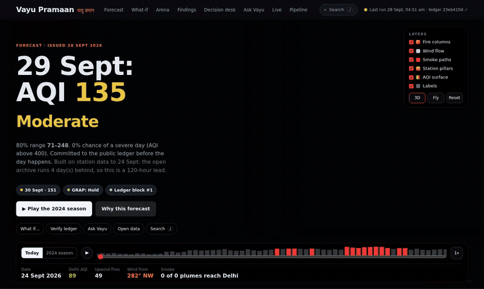
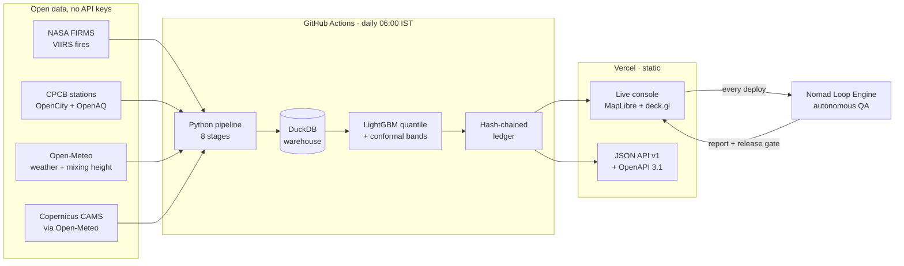
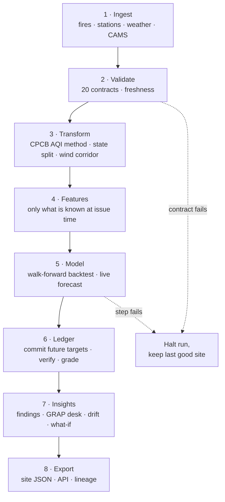

# Vayu Pramaan

**Delhi air-quality forecasts you can verify.** Every forecast is hashed into a public ledger before the day it predicts, then graded in the open against CPCB station readings, simple baselines and Copernicus CAMS.

[](https://vayu-pramaan.vercel.app)
[](https://github.com/lakshaysharmaug22-crypto/vayu-pramaan/actions/workflows/ci.yml)
[](https://github.com/lakshaysharmaug22-crypto/vayu-pramaan/actions/workflows/daily.yml)
[](https://github.com/lakshaysharmaug22-crypto/vayu-pramaan/actions/workflows/nomad-qa.yml)
[](LICENSE)


**[Live console](https://vayu-pramaan.vercel.app)** · [Public API](https://vayu-pramaan.vercel.app/api/v1/catalog.json) · [OpenAPI spec](https://vayu-pramaan.vercel.app/api/v1/openapi.json) · [QA report on Nomad Loop Engine](https://nomad-loop-engine.vercel.app/target)



## Results

Walk-forward backtest over seven October–November smog seasons (2019–2025, 427 forecast days per lead). The model is retrained before each season and never sees the season it is scored on. Runs are deterministic: the same data gives the same numbers.

| Lead | MAE (AQI) | Persistence | Skill vs persistence | Diebold-Mariano p | 80% band coverage |
|---|---|---|---|---|---|
| 1 day | **32.7** | 35.0 | 6.5% | 0.067 | 78% |
| 2 days | **44.3** | 50.3 | 11.8% | 0.008 | 71% |
| 3 days | **49.8** | 57.7 | 13.8% | 0.007 | 72% |
| 6 days | **54.9** | 71.2 | 22.9% | <0.001 | 67% |

- **Severe days (AQI > 400):** 20 of 67 caught one day ahead (CSI 0.25).
- **Data:** 667,875 satellite fire detections, 2.33M hourly readings from 37 CPCB stations, and 3,467 city-AQI days (from Jan 2017).
- **Pipeline:** 3.2M raw rows checked against 20 data contracts in about 90 seconds a run, every day on GitHub Actions.
- **Integrity:** SHA-256 Merkle roots in a hash chain. The chain is verified in CI and in the visitor's browser, and anchored with OpenTimestamps.

## How it works



### Pipeline flow



Every step writes rows in/out, checks, freshness and timing to `data/runs/run_*.json`. The console's Pipeline and Lineage views are drawn from those manifests.

## What's in the console

| Section | Skill shown | What it does |
|---|---|---|
| 3D map | Geospatial viz | Fire columns, wind and smoke paths, station pillars and an AQI surface, with season playback and a fly-through camera |
| Next 72 hours | Data science | p10/p50/p90 forecasts, backtest against baselines, calibration, SHAP drivers |
| What-if | Data science | Re-forecast with more or fewer fires, a different wind or mixing height |
| Model arena | ML evaluation | LightGBM vs ridge, persistence and climatology, with CAMS as a reference |
| Smog findings | Data analysis | Six SQL studies: smoke travel time, wind corridor, local floor, state split, Diwali, CAMS misses |
| GRAP decision desk | Business analysis | Turns P(severe) into a GRAP call; cost sliders set the warning threshold; stakeholder memo |
| Ask Vayu | AI analytics | Text-to-SQL agent on read-only views with guardrails and a 25-question eval set |
| Pipeline, Lineage, Health | Data engineering | Run manifests, DAG with live counts, seasonal PSI drift monitor |
| Open data | Data engineering | Static JSON API v1, OpenAPI 3.1 spec, dataset catalog |
| Public ledger | Systems | Verify any block in the browser with the Web Crypto API |
| Tested by Nomad Loop | QA engineering | Latest autonomous QA scan of this site |

Press `/` anywhere in the console to search dates, stations, findings and endpoints.

## Design decisions

- **Honest lead time.** The open station archive runs 1–4 days behind. Lead is counted from the last verified reading, and `ledger.commit` rejects any row whose target date is not in the future.
- **Beat the dumb baseline first.** Every metric is reported against persistence and climatology, with a Diebold-Mariano test, before anything else.
- **Calibrated uncertainty.** Quantile models plus split-conformal widening, so the 80% band is a checked claim, not decoration.
- **Static by design.** The site is plain files on a CDN. There is no server to keep alive, and the API is versioned JSON.
- **Release gate.** [Nomad Loop Engine](https://github.com/lakshaysharmaug22-crypto/nomad-loop-engine) explores the production site after each deploy and fails the check on a confirmed major bug. Both projects show the same report.

## Run it locally

```bash
git clone https://github.com/lakshaysharmaug22-crypto/vayu-pramaan && cd vayu-pramaan
python -m venv .venv && . .venv/bin/activate        # Windows: .venv\Scripts\activate
pip install -r requirements.txt

python -m vp run --synthetic --mode history --no-llm   # offline, generated data, about 2 min
python -m vp verify                                    # check the public ledger
python -m http.server -d site 8000                     # open http://localhost:8000
```

Real data: `python scripts/fetch_opencity.py && python -m vp run --mode history`. Synthetic runs write to `data/synthetic/` and never touch real data or the ledger.

Optional secrets: `GROQ_API_KEY` or `GEMINI_API_KEY` (AI brief and agent), `FIRMS_MAP_KEY` (fire-data fallback).

## Tests and CI

- `tests/`: ledger tamper detection and Merkle proofs, SQL guard, CPCB breakpoints, PSI, station-file parsers.
- **ci.yml:** unit tests, then the full pipeline on synthetic data, then ledger verification, on every push.
- **daily.yml:** forecast, commit, verify, timestamp and publish.
- **nomad-qa.yml:** QA scan after every production deploy.

## Project structure

```
vp/            pipeline: ingest, warehouse, features, model, ledger, insights, agent, export
site/          static console (vanilla JS, MapLibre GL, deck.gl) and JSON API
ledger/        append-only forecast ledger (JSONL entries + hash chain + .ots proofs)
data/runs/     run manifests
scripts/       station-file fetcher, Nomad report adapter
tests/         unit tests
```

## Roadmap

- **Severe-day recall** beyond one day ahead: a dedicated classifier for AQI > 400.
- **Winter band calibration:** coverage runs 67–78% against 80%. The plan is to calibrate conformal bands by season.
- **Fresher station data:** a live CPCB feed to shorten the 1–4 day archive lag.

## Data sources

NASA FIRMS VIIRS active fires · CPCB continuous monitoring stations (via OpenCity and the OpenAQ archive) · Open-Meteo historical and forecast weather · Copernicus Atmosphere Monitoring Service via Open-Meteo · Natural Earth boundaries. Each source's attribution terms apply.

## Author

**Lakshay Sharma** · [GitHub](https://github.com/lakshaysharmaug22-crypto)

Released under the [MIT License](LICENSE).
